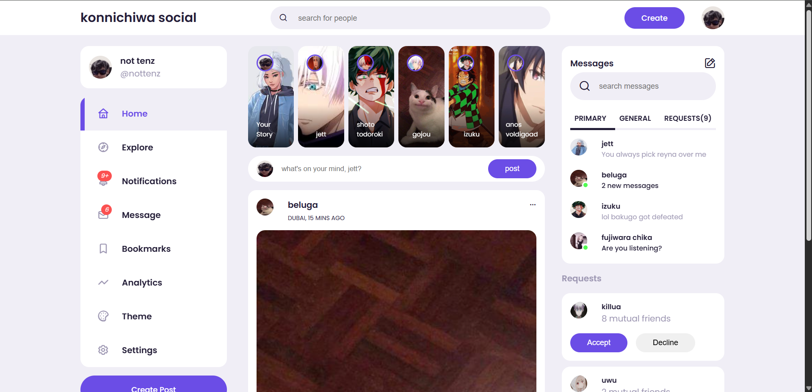
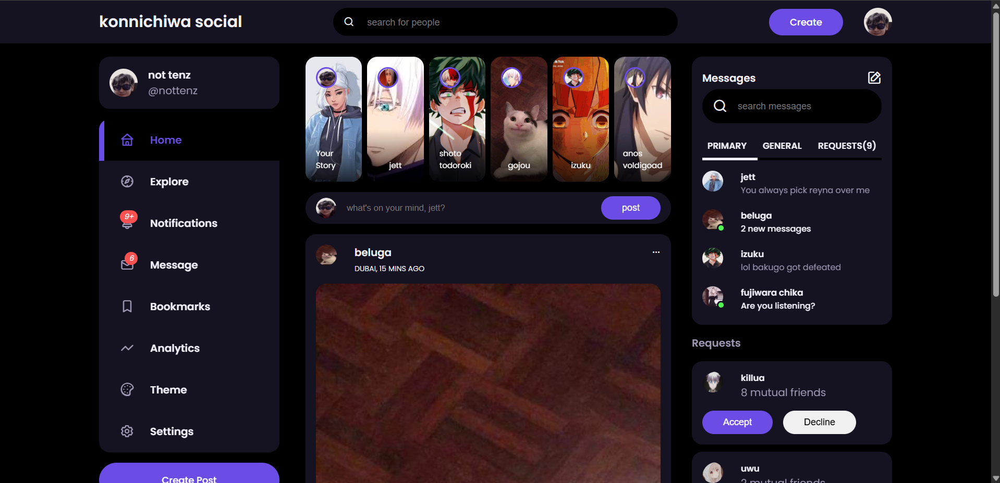
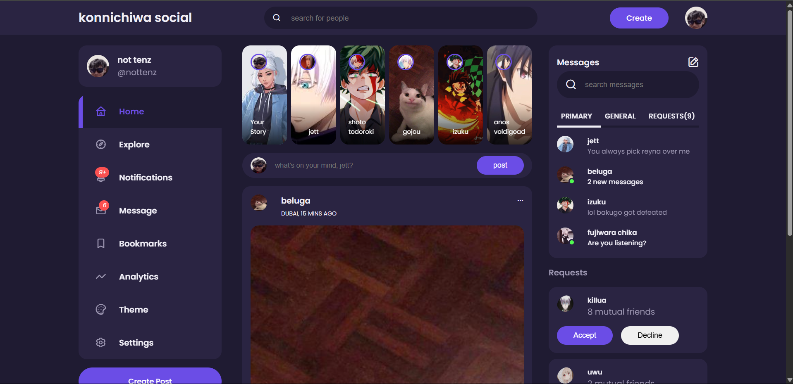
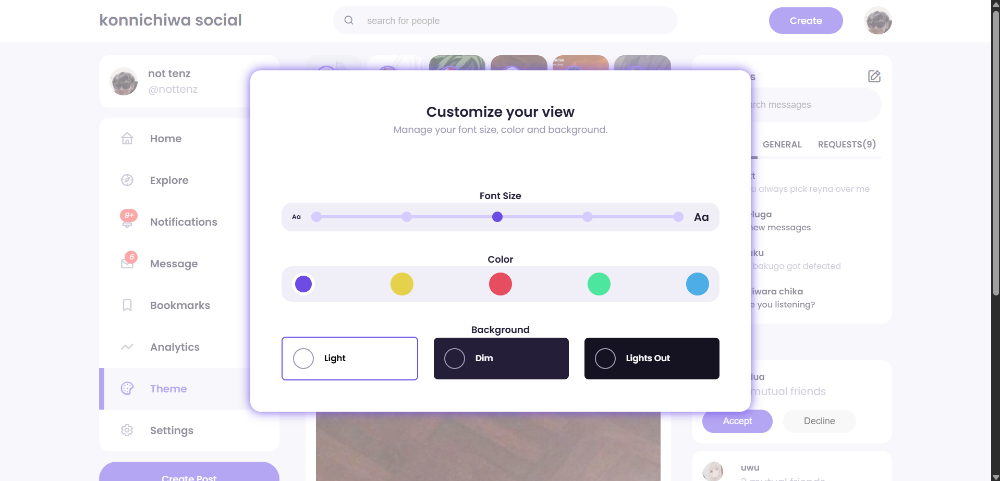

# 🌐 Social Media UI Settings

A responsive frontend-only project simulating a social media settings panel. Built using **HTML**, **CSS**, and **JavaScript**, this UI/UX demo allows users to personalize their interface with dark mode, theme color options, font sizing, and more — all without any frameworks.

---

## ✨ Features

- 🌞 Toggle between **Light**, **Dim**, and **Lights Out** modes  
- 🎨 Choose from multiple **theme colors**  
- 🔠 Change **font sizes** for accessibility  
- 🖼️ Switch between **light/dark background** for modals  
- 📱 Fully responsive layout  
- ⚙️ Pure **vanilla HTML, CSS, and JS**

---

## 🚀 Live Demo

- 🔗 [GitHub Pages](https://mohitmehtre.github.io/socialmedia-ui-settings/)
- 🔗 [Netlify](https://konnichiwa-social.netlify.app/)

---

## 📸 Preview

### 🌞 Light Mode

---

### 🌚 Lights Out (Very Dark Mode)

---

### 🌘 Dim Mode (Less Dark)

---

### 🎨 Settings Modal (Color Change, Font Size, Background)

---

## 💻 Tech Stack

- HTML5  
- CSS3  
- JavaScript (Vanilla JS)

---

## 📁 Project Structure

📁 socialmedia-ui-settings/ ├── index.html ├── style.css ├── index.js ├── images/ │ ├── light-mode.png │ ├── lights-out.png │ ├── dim-mode.png │ └── settings-modal.png └── LICENSE
